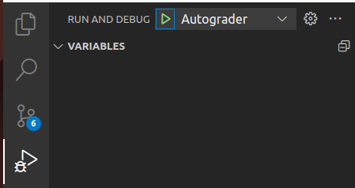

# Verifessor
 An autograding framework for Verilog

 Supports VSCode dev containers, Github Codespaces, and Github Actions

---
## Getting Started

If you plan on running this locally, then you will need Docker and VSCode on your system.  If you do not already have the Dev Containers extension installed, VSCode should automatically prompt you to install it.  Once the Dev Containers extension is installed, you should be prompted to reopen the repository inside of a [Dev Container](https://code.visualstudio.com/docs/devcontainers/tutorial).

The dev container will automatically setup a few extensions for verilog syntax completion and highlighting, as well as for working with the Python autograder.

The next steps depend on what you intend to do with this repository:

* [Running the Grader](#running-the-grader)
* [Creating New Tests](#creating-new-tests)

### Running the Grader
The easiest way to run the autograder is from VSCode.  The "Run and Debug" tab has a preconfigured debug profile that will automatically run the autograder.

When the autograder is finished running, it will automatically generate a report file located at the root of the repository called [report.md](report.md).

### Creating New Tests

New projects are created by adding creating a subfolder in the projects folder.  Each project must have a Makefile that compiles the testbench and project code.  The Makefile should generate a binary with the default file name of `a.out`.  The autograder will automatically build the project, and then execute it.  Each problem within the test should output its results in CSV format.  

The fields are as follows:

| Problem Number | Score | Max Possible Score |
| --- | --- | --- |
